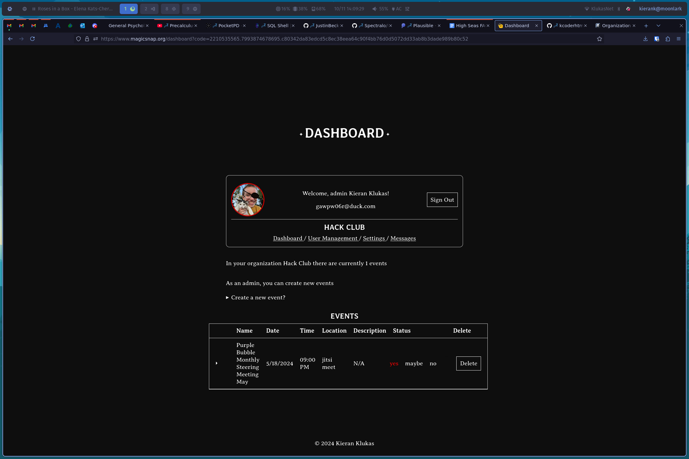
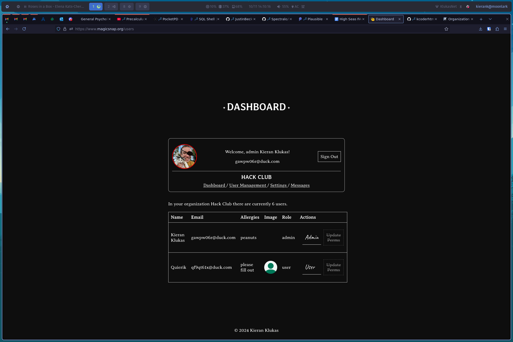
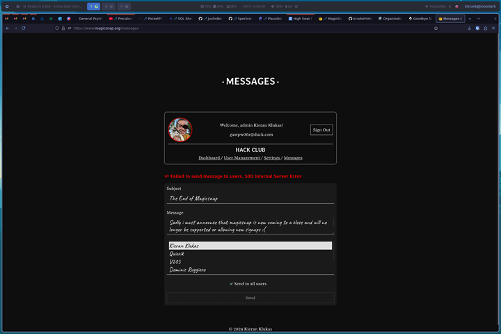
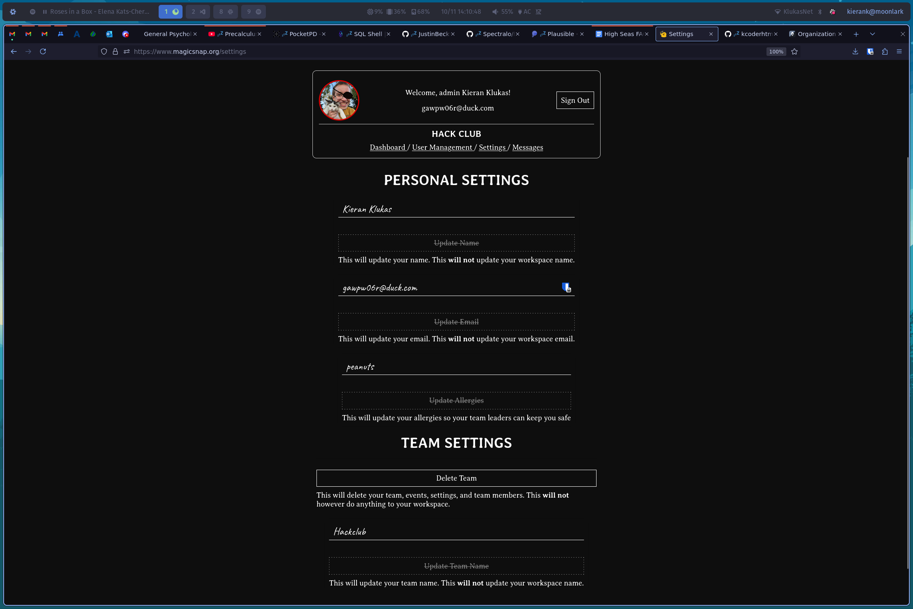

# MagicSnap

  

  A modern, easy to use, and open source team management software

## About

MagicSnap was a project I started thinking about around December of 2023 when I joined a frc robotics team for the first time. My team was using teamsnap at the time but no one liked it, it was exceptionaly clunky, slow, and riddled with ads for the free tier. My goal became to make a better solution both to give my team a better solution and to have an interesting project to work on.  

I've been working on this project for over 2 months of active development now and I'm quite proud of it. (several months later i'm still proud of it but more as something that helped me learn a bunch about making a more complex program) The main site is hosted on netlify with serverless functions providing access to astro db where all the data is stored for the team. Emails are provided by a cloudflare worker based off of [Sh4yy/cloudflare-email](https://github.com/Sh4yy/cloudflare-email) which can be found here [kcoderhtml/cloudflare-email](https://github.com/kcoderhtml/cloudflare-email). The site is written in astro and is fully typescript native.

## Screenshots

I included screenshots of all the dashboard pages below

    
Click to open the rest

    
    
    

## License

This repositories code is licensed with the AGPL-3.0 license and you can view it [here](/LICENSE.md)